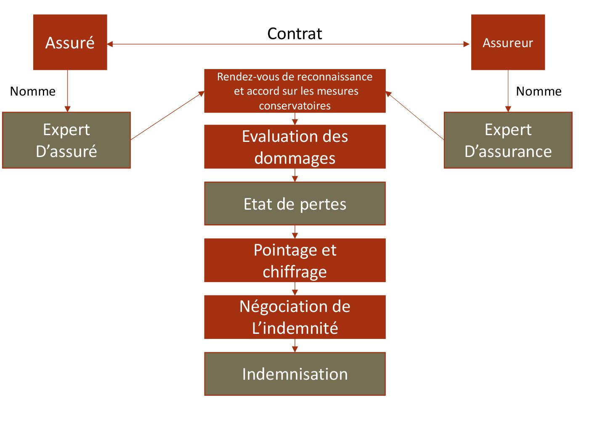

# ACTIVITÉS SPORTIVES : RESPONSABILITÉS ET ASSURANCES

1 - LA PRATIQUE INDIVIDUELLE La réalisation d'une activité sportive
(judo, karté, football...) exercée en toute liberté appelle, sur le plan
de la responsabilité, à distinguer deux situations :

| **vous êtes responsable d'un dommage causé à autrui** |
|:------------------------------------------------------|
| **vous êtes responsable d'un dommage causé à autrui** |

### 1.1 - Vous êtes responsable d'un dommage causé à autrui

Au cours de votre pratique sportive, si vous blessez quelqu'un par votre
faute ou votre imprudence, conformément aux articles 1240 et 1241 du
code civil, vous êtes civilement responsable. Exemple : un coup porté
par un karatéka à son adversaire, poing ouvert et doigts tendus et de
manière particulièrement violente, constitue une faute dont le sportif
doit répondre (Cass. civ. II, 23 septembre 2004, n° 03-11274)
